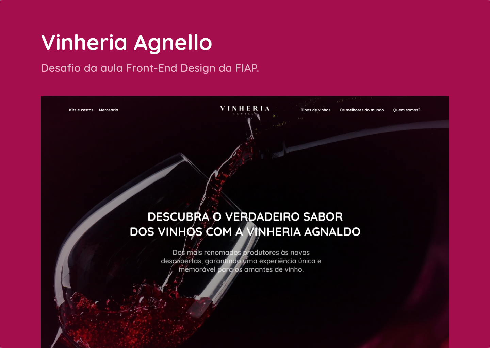

# Vinheria Agnello

Este é o repositório de uma página simples da Vinheria Agnello criada com Phosphor-Icons, HTML, CSS e JavaScript e foi desenvolvida para fins educativos/acadêmicos.

## Protótipo

Para acessar o protótipo do website, acesse o link do [Figma](https://www.figma.com/file/X3sWex2pdnP3qfBCXwE9Cu/FIAP-Front-End?node-id=62%3A534&t=G3NES7HQyoN3d8rY-1).

## HTML, CSS e JavaScript

A página foi criada com HTML5, CSS3 e JavaScript. O HTML foi estruturado de forma semântica, utilizando as tags apropriadas para cada elemento. O CSS foi utilizado para estilizar a página, definindo fontes, cores, tamanhos e posicionamentos. O JavaScript foi usado para interatividade, como a exibição de uma mensagem de boas-vindas ao usuário.

## Phosphor-Icons

Phosphor-Icons é uma biblioteca de ícones open-source, disponível em [phosphoricons.com](https://phosphoricons.com/). Os ícones são criados com linhas finas, de alta qualidade e podem ser usados em projetos pessoais ou comerciais.

## Como usar

1. Clone ou faça o download deste repositório para sua máquina.
2. Abra o arquivo `index.html` em um navegador de sua escolha. (Para melhor funcionamento utilize a extensão Live Server)
3. A página será carregada e você poderá visualizar os ícones e interagir com a mensagem de boas-vindas.

## Licença

Este projeto é licenciado sob a licença MIT. Veja o arquivo LICENSE para mais detalhes.
